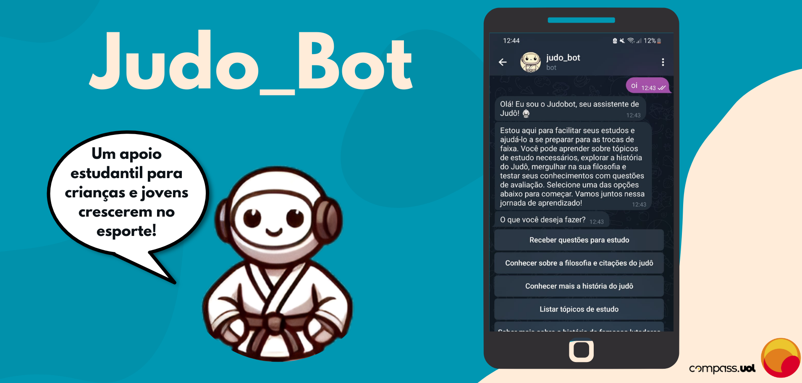
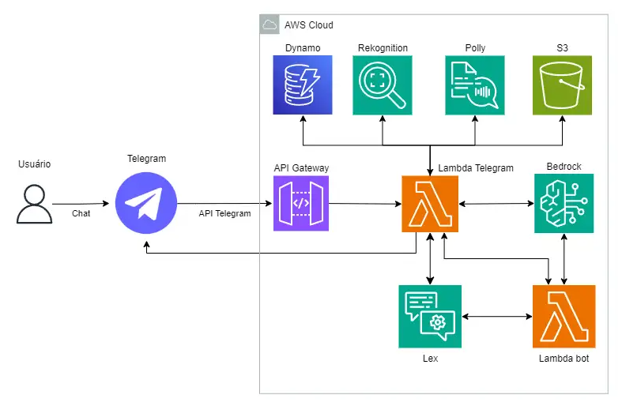

<h1 align="center">  🤖 Judo_Bot 🥋 </h1>

  

## 📜 Sobre o Projeto
Este projeto tem como objetivo transformar a vida de crianças em situação de vulnerabilidade no Brasil, que veem no judô uma oportunidade de um futuro melhor. Em diversos projetos de judô espalhados pelo país, essas crianças aprendem valores como disciplina, perseverança e respeito. No entanto, elas enfrentam desafios para acessar o conteúdo teórico necessário para as trocas de faixas e para seu progresso no esporte.

Para modernizar e facilitar esse processo de aprendizado foi criado o Judo_Bot. O chat bot permite que jovens e crianças, de qualquer lugar, possam acessar o bot, e através de uma conversa interativa selecionar a cor da faixa que desejam alcançar e receber automaticamente questões que simulam os exames teóricos, permitindo que estudem de forma eficaz e acessível.  Além disso, o sistema oferece formação filosófica sobre as raízes e a história do judô, promovendo inclusão, aprendizado e desenvolvimento de habilidades essenciais. Para o desenvolvimento dessa solução, o projeto utiliza serviços modernos da AWS, como Amazon Polly, Rekognition, Bedrock e Lex.


## ✅ Funcionalidades

- `Receber questões para estudo`: Oferece perguntas simuladas, de acordo com a cor da faixa, para praticar os conteúdos teóricos exigidos para o exame.
- `Conhecer sobre a filosofia e citações do judô`: Apresenta ensinamentos filosóficos do judô, além de citações inspiradoras relacionadas ao esporte, com foco em valores como disciplina e respeito.
- `Conhecer mais a história do judô`: Fornece informações sobre as origens do judô como a sua criação, judô no Brasil, principios que idealizaram o judô e além disso permite que o usuário formule sua própria pergunta para saber mais informações históricas. 
- `Listar tópicos de estudo`: Exibe os diferentes temas que as crianças devem estudar para os exames de troca de faixas de acordo com a cor, ajudando a organizar o processo de aprendizado.
- `Saber mais sobre a história de famosos lutadores`: A fornecer uma imagem de uma personalidade ao bot, o atleta é reconhecido, e são retornadas informações sobre sua história no judô, inspirando as crianças com suas trajetórias e conquistas.
- `Encerrar a conversa`: Ao escolher esta opção, o bot envia uma mensagem de encerramento junto com um áudio e texto contendo uma frase filosófica de Jigoro Kano (fundador do Judô), oferecendo uma última reflexão inspiradora.

## 📱 Como usar a Aplicação
- No telegram acesse o link:
 ```
 t.me/juju2_judobot
``` 

## 📂 Estrutura de Pastas

```bash   
  └── 📁 src
      ├── 📁 api
      │   ├── 📁 routes
      │   │   ├── handler.py
      │   │   ├── integration.py
      │   │   └── integration_audio.py
      │   ├── 📁 services
      │   │   ├── 📁 audio
      │   │   │    ├── text_to_block.py
      │   │   │    └── tts_polly.py
      │   │   ├── 📁 image
      │   │   │    ├── bedrock_call.py
      │   │   │    ├── image_handler.py
      │   │   │    └── rekognition_call.py
      │   │   ├── 📁 lex
      │   │   │    ├── lex_call.py
      │   │   │    └── return_message.py
      │   │   └── 📁 telegram
      │   │        ├── save_image.py
      │   │        └── telegram_files.py
      │   ├── .env.example
      │   └─── serveless.yml
      └── 📁 bot
          ├── 📁 lex_bot
          │   └── judo-bot-LexJson.zip
          └── 📁 lex_lambda
              ├── 📁 intents
              │    ├── ExitBot_Intent.py
              │    ├── FallbackIntent.py
              │    ├── History_Intent.py
              │    ├── Philosophy_Intent.py
              │    ├── Quests_Intent.py
              │    └── Study_Intent.py
              ├── bedrock_handler.py
              ├── lambda_function.py
              └── utils.py
                              
```
## ⚙️ Tecnologias Utilizadas
`Telegram` • `API Gateway` • `AWS Lambda` • `S3` • `DynamoDB` • `Rekognition` • `Polly` • `Lex` • `Bedrock (Amazon Titan Text Premier )` 

## 🌐 Arquitetura do Projeto
  

## 🔐 Dificuldades
- Contrução do Lex e lambdas
- Escopo do projeto nas tecnologias pedidas

## 👨‍💻 Autores
- [Gustavo Henrique Vago Brunetti](https://github.com/GustavoBrunetti) 
- [Katarina Lydia Friedrich](https://github.com/katfr)
- [Leandro Rodrigues de Paula Castro](https://github.com/lrpc75) 
- [Leonardo Loureiro de Almeida](https://github.com/lloureiro2) 
- [Manoella dos Reis Leite](https://github.com/ManoellaReis)
